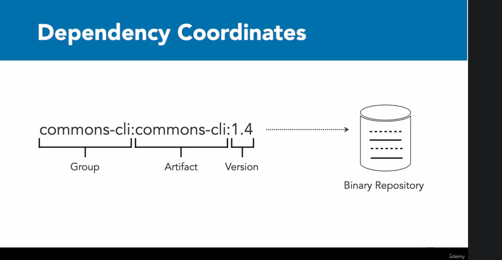
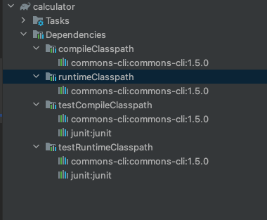
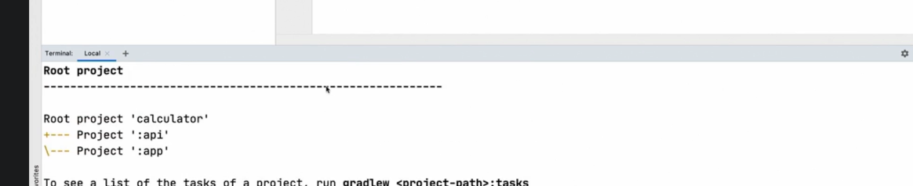
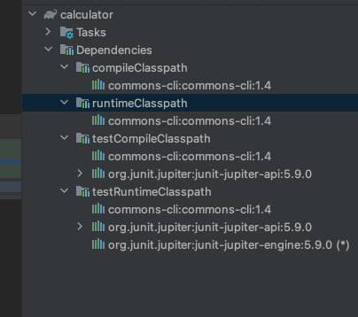

# GRADLE FUNDAMENTALS #  
  * [4 What is GRADLE](#4-what-is-gradle)
    + [The 6 Key Pieces of Gradle](#the-6-key-pieces-of-gradle)
  * [32 Project Object Model](#32-project-object-model)
  * [5 Installing Gradle](#5-installing-gradle)
  * [6 Gradle's DSL](#6-gradle-s-dsl)
  * [7 Gradle Wrapper](#7-gradle-wrapper)
  * [9 Build Files](#9-build-files)
  * [10 Tasks](#10-tasks)
    + [AD HOC vs Typed Tasks](#ad-hoc-vs-typed-tasks)
  * [DAG & Build Lifecycle Phases](#dag---build-lifecycle-phases)
    + [Directed Acyclic Graph](#directed-acyclic-graph)
  * [12 Plugins and Domain Objects](#12-plugins-and-domain-objects)
    + [Script Plugins vs Binary Plugins](#script-plugins-vs-binary-plugins)
    + [Domain Objects in Memory](#domain-objects-in-memory)
  * [13 Documentation](#13-documentation)
  * [15 Building a JAVA project](#15-building-a-java-project)
    + [JAVA Gradle Plugin](#java-gradle-plugin)
  * [16 Compiling Java Source Code](#16-compiling-java-source-code)
    + [Packaging a Jar](#packaging-a-jar)
  * [17 Application Plugin](#17-application-plugin)
  * [18 Understanding Dependencies](#18-understanding-dependencies)
    + [Dependency Declaration](#dependency-declaration)
  * [19 Dependency Tree](#19-dependency-tree)
  * [20 Multi Project Dependency](#20-multi-project-dependency)
  * [21 Publishing Libraries](#21-publishing-libraries)
  * [22 JUnit](#22-junit)
    + [Declaring Dependencies in the Build Script######](#declaring-dependencies-in-the-build-script------)
  * [23 Executing Tests](#23-executing-tests)
  * [42 Gradle Profiling](#42-gradle-profiling)

## 4 What is GRADLE ##

- solves the problem of building and deploying an application once it is written
- framework for building a project
- turns java classes, xml etc. into jar and war files
 
- Both builds the deployment artifacts and manages the dependencies
 
- Artifacts can be : java source code, xml configuration files, audio or graphic files etc...
- Predecessors to GRADLE include Maven, IVY and ANT. These are configured with XML which is not the most user-friendly

- In 2007 Gradle was introduced, it is written in a Java variant called Groovy (or Kotlin), this is much more user-friendly because we are writhing configurations as code

- Plugins are used for adding functionally to gradle
- Dependencies are used for adding functionality to src code

### The 6 Key Pieces of Gradle ###
1. Build File or build.gradle : must have a build file, 
   - this is both a human and machine-readable instruction file, 
   - uses DSL (Domain Specific Language) at a higher level and Groovy (or Kotlin) at a low level.
   - Default name is build.gradle 

2. Constructs a Graph of Tasks
   - tasks are detailed build steps
   - gradle parses the build.gradle to create a Directed Acyclic (one way only) Graph (DAG) of tasks, ie task1 -> task 2 -> task 3 ...

3. Gradle Executes the Tasks
   - knows the order to do tasks in based on the DAG
   - Each task produces an output used that can be used as an input by the next task
   - it saves the output of each task (this step can help with performance improvement by caching tasks outputs for tasks that have not changed and skip the task on a re-build)

4. Manages Dependencies
   - ie: maven, plugins etc...
   - Also manages transitive dependencies, ie: dependencies of dependencies
   - Can also handle dependency versions

5. Gradle uses Repositories
   - public or local

6. Gradle is Self Updating
   - gradle can update both itself and the dependencies it manages


## 32 Project Object Model ###
- [project properties docs](https://docs.gradle.org/current/dsl/org.gradle.api.Project.html#N14E9A)

- whenever we have a new gradle project, have a build.gradle, settings.gradle etc..
- for each build.gradle, gradle creates a new java class of type Project. 
- in these gradle files we can directly interact with and changes properties of that Project class

ex:
```
java {
    //telling gradle we need a version of 11 for compatibility with our source code
    sourceCompatibility(JavaVersion.VERSION_11)
}

```

```./gradlew properties``` prints out all the gradle properties for this project


## 5 Installing Gradle ##
- can install with brew or manually
- [gradle.org](https://gradle.org/install/)

         brew install gradle

Basic Terminology
- Project - models a software component
- Build script: contain automation instructions for a project
- Task: defines executable automation instructions 
- to see a helloWorld in gradle navigate too ./hello-world/build.gradle
  - can run with ```gradle [taskName]```

## 6 Gradle's DSL ##
- can mix in imperative logic 
- can use Groovy DSL or Kotlin DSL
- can see kotlin example ./hello-world-kotlin/build.gradle.kts
   - has to be named build.gradle.kts
   - seems that by default a build.gradle will override build.gradle.kts if they are in the same directory, maybe some configuration to change this

## 7 Gradle Wrapper ##
- Gradle API can have breaking changes during major version updates
- maintaining multiple different gradle version on your machine for different projects is in inconvenient 

- The Gradle wrapper is a set of files checked into version control with source code
   - The wrapper standardizes a compatible gradle version for the project
   - It will automatically download the defined version of Gradle

- You can create the gradle wrapper by running ```gradle wrapper```
   - this will create a gradle folder that houses a gradle-wrapper.jar and a gradle-wrapper.properties 
   - gradle-wrapper.jar
     - which is a small java program in itself
     - takes in the gradlew command, and looks to see if the gradle version we have installed in the gradle version we want for out project
     - checks the gradle-wrapper.properties for this information and can use the distribution url in the properties file to download the requisite version of gradle if necessary
   - gradle-wrapper.properties
      - holds information about which version of gradle we created the wrapper with
      - if we wanted to change the version of gradle our wrapper/project was using we can modify the distributionUrl key in the gradle-wrapper.properties
   - it also creates a gradlew shell script, and gradlew.bat(for windows)
   - This now exposes the gradlew command within the project, to run the tasks now we can use ```.gradlew [task name]```
   - when using gradlew gradle will automatically download the distribution needed to run the task based on what has been defined in the jar and properties files
   - When using a wrapper it is not necessary to have gradle installed on your machine, however you do need it to create the wrapper

- **With the wrapper method, other developers do not even need to install gradle on their machines, they can just check out the code (as long as wrapper is store in VCS) and run gradle commands with ```./gradlew [taskName]```**

## 9 Build Files ##
- Build file in a single module/project build 
   - resides in root directory of project hierarchy
   - contains all build logic
   - can be hard to maintain 

- Build file in multi-module build
   - There is a build.gradle that contains modules which contain their own build.gradle
   - more maintainable and highly cohesive
   - gradle can model each component as a project with dependencies of each other

- Settings File
   - settings.gradle resides in root directory of project hierarchy
   - can declare participating projects as modules
   - change defaults such as project name 
   - can set plugin management and authentication for private repos

- By default, gradle defines the project name as the name of the root directory
   - can run ```gradle projects``` to see all projects in the current folder and sub folders
   - ./gradle-wrapper-hello-world/settings.gradle

- Gradle.properties
  - ./gradle-wrapper-hello-world/gradle.properties
  - resides in the root directory of project (for one offs) or ~/.gradle (for all projects on machine)
  - can be used to pre-configure runtime behavior
  - can setup custom env vars, set versions, logging levels etc
  - can access these values in the build script by key 

## 10 Tasks ##
- define an executable unit of work
- actions (ex: doLast) contain logic to be executed a runtime

### AD HOC vs Typed Tasks ###
- ad hoc task implement one-off simplistic actions by defining a doFirst or doLast

- Automatically extend the default task without having to declare it 

ex: 

      task runADHOC {
         doLast {
            println "I am an AD HOC task, I automatically extend the default task"
         }
      }
   
- Typed tasks allow for more complex task logic
- Typed tasks explicitly declare a type
- does not necessarily need to define actions, may inherit them from the task it is extending 
- copy type can copy files and directories from A to B

ex: 

      task copyFiles(type: Copy){
         from "sourceFiles"
         into "target"
      }

another example: 

      task createZip (type: Zip){
         from ".build/docs"
         archiveName = "example.zip"
         destinationDir = file(".build/dist")

         //can make this task depend on the previous one and hence make it do the copyFile task first
         dependsOn copyFiles
      }

- dependsOn calls copyFiles before the createZip method code runs

## DAG & Build Lifecycle Phases ##
- [Properties](https://docs.gradle.org/current/dsl/org.gradle.api.Task.html#N18B7E)
- [Methods](https://docs.gradle.org/current/dsl/org.gradle.api.Task.html#N18C9B)
- Directed Acyclic Graph 
- if A depends on B and A also depends on C, then B & C can run in any order, however they will both run before A

- Can use mustRunAfter if we always want C to run before B
- other common caveats are shouldRunAfter and finalized by
   - mustRunAfter - 	Specifies that this task must run after all the supplied tasks.
   - shouldRunAfter - Specifies that this task should run after all the supplied tasks.
   - finalizedBy - Adds the given finalizer tasks for this task.

### Directed Acyclic Graph ###
- a task is represented as a node
- task dependency is represented as graph edge

- task A cannot depend on B while B depends on A
- can run ```gradle [task] --dry-run ``` to see all gradle tasks/dependencies for that task
- can use the [gradle task tree](https://github.com/dorongold/gradle-task-tree) plugin in order to render a task tree

- can run ```gradlew tasks --all``` to see all gradle tasks available for the project

- the DAG is built before any tasks is executed
   - when a task is called to be executed gradle will:
     
     1. Evaluate the instructions of the build scripts
     2. create and configure tasks 
     3. execute them in the correct order

LifeCycle Phases: 

1. Initialization phase
   - evaluates the settings.gradle file, gathering information about the projects that should exist for the build
2. Configuration phase
   - Parses and evaluates the configuration logic, here tasks actions are not executed, only configured
   - configuration code configures the project and its tasks
3. Execution phase
   - Execute tasks in the correct order based on the DAG
   - any logic that is executed here should be defined as part of the doFirst or doLast 

## 12 Plugins and Domain Objects ##
- goal of plugins 
   1. avoid repetitive code
   2. make logic more maintainable
   3. Provide reusable functionality across projects

### Script Plugins vs Binary Plugins ##

- Script plugin is another build script that can be included in your build.gradle
  - ex : publishing.gradle or deployment.gradle
  - can define tasks in these other files to better compartmentalize our task definitions

- Binary Plugins are meant for mor complex logic ( MAVEN Dependencies)
   - implement as classes and bundled as jar files
   - ex: java plugin or gradle core plugin

### Domain Objects in Memory ###
- [docs.gradle - domain objects/core types](https://docs.gradle.org/current/dsl/index.html#N100CA)
- Gradle represents the DAG in memory
- Each node of the graph represents a task
- Tasks are just one domain object of a build
- Domain objects can be inspected and modified from the build script

- The Gradle Domain Object 
   - org.gradle.invocation.gradle
   - represents the invocation of build
   - has knowledge of project hierarchy
   - provides pointers to the higher level properties of a build (ex: users gradle home directory, ~/.gradle on mac)
   - can register callback logic to react to certain events in a build

- The Project Domain Object
   - org.gradle.api.Project
   - represents a software component and provides PAI access to object hierarchy
   - could ask for the reference to the gradle instance
   - could register new tasks
   - could get and or modify the environmental properties' ex: build output directory

- The Task Domain Object
   - org.gradle.api.Task
   - performs actual work at run time
   - represents unit of work with potential dependencies
   - tasks define actions 

- The Action Domain Object
   - org.gradle.api.Action
   - toFirst and toLast are actions
   - Actual work performed during the execution phase

- The Plugin Domain Object
   - org.gradle.api.Plugin
   - plugin has full access to the project it works on, can access other domain object by name or type and modify them as necessary
   - provides reusable logic for a project (ex: build task that comes with the java plugin)

## 13 Documentation ##
- build script can be mapped to Gradle API
- [gradle user manual](https://docs.gradle.org/current/userguide/userguide.html)
- gradle is built with java, so you can read the [java docs](https://docs.gradle.org/current/dsl/org.gradle.api.tasks.javadoc.Javadoc.html)

## 15 Building a JAVA project ##
- can run java compiler with ```javac src/main/java/com/linkedinlearning/calculator/*.java -d out```
- can create a jar from the compiled code with ```jar cfv calculator.jar -C out .```

### JAVA Gradle Plugin ###
- [java plugin docs](https://docs.gradle.org/current/userguide/java_plugin.html#header)
- shipped with gradle distribution
- provides task tha use conventions and sensible defaults, such are source code directories , build output folders etc...
- These defaults can be reconfigured in the build scrip to adapt to legacy/custom project structures

Expected directory structure of the java plugin:
  - src/main/java: contains production source code
  - src/main/resources: contains resource files needed for runtime, such as properties, yml files, env vars etc...
  - src/test/java: contains test source code
  - src/test/resources: contains test resource files
  - build/classes: contains compiled class files
  - build/libs: contains generated jar files

Provided Tasks:
  - [java plugin task docs](https://docs.gradle.org/current/userguide/java_plugin.html#sec:java_tasks)
  - suited for triggering typical operations in java projects, such as build, test, lint etc...

Tasks: 

**compileJava** — JavaCompile

  - Depends on: All tasks which contribute to the compilation classpath, including jar tasks from projects that are on the classpath via project dependencies

  - Compiles production Java source files using the JDK compiler.

**processResources** ProcessResources 

  - Copies production resources into the production resources directory.

**classes**

  - Depends on: compileJava, processResources

  - This is an aggregate task that just depends on other tasks. Other plugins may attach additional compilation tasks to it.

**compileTestJava** — JavaCompile

  - Depends on: classes, and all tasks that contribute to the test compilation classpath

  - Compiles test Java source files using the JDK compiler.

**processTestResources** — Copy

  - Copies test resources into the test resource directory.

**testClasses**

  - Depends on: compileTestJava, processTestResources

  - This is an aggregate task that just depends on other tasks. Other plugins may attach additional test compilation tasks to it.

**jar** — Jar

  - Depends on: classes

  - Assembles the production JAR file, based on the classes and resources attached to the main source set.

**javadoc** — Javadoc

  - Depends on: classes

  - Generates API documentation for the production Java source using Javadoc.

**test** — Test

  - Depends on: testClasses, and all tasks which produce the test runtime classpath

  - Runs the unit tests using JUnit or TestNG.

**clean** — Delete

  - Deletes the project build directory.

**cleanTaskName** — Delete

  - Delete files created by the specified task. For example, cleanJar will delete the JAR file created by the jar task and cleanTest will delete the test results created by the test task.

**SourceSet** Tasks

  - For each source set you add to the project, the Java plugin adds the following tasks:

**compileSourceSetJava** — JavaCompile

  - Depends on: All tasks which contribute to the source set’s compilation classpath

  - Compiles the given source set’s Java source files using the JDK compiler.

**processSourceSetResources** — Copy

  - Copies the given source set’s resources into the resource directory.

**sourceSetClasses** — Task

   - Depends on: compileSourceSetJava, processSourceSetResources

   - Prepares the given source set’s classes and resources for packaging and execution. Some plugins may add additional compilation tasks for the source set.

Lifecycle Tasks:

The Java plugin attaches some of its tasks to the lifecycle tasks defined by the Base Plugin — which the Java Plugin applies automatically — and it also adds a few other lifecycle tasks:

**assemble**

  - Depends on: jar, and all other tasks that create artifacts attached to the archives configuration

  -Aggregate task that assembles all the archives in the project. This task is added by the Base Plugin.

**check**
  - Depends on: test

  - Aggregate task that performs verification tasks, such as running the tests. Some plugins add their own verification tasks to check. You should also attach any custom Test tasks to this lifecycle task if you want them to execute for a full build. This task is added by the Base Plugin.

**build**
  - Depends on: check, assemble

  - Aggregate tasks that performs a full build of the project. This task is added by the Base Plugin.

**buildNeeded**
  - Depends on: build, and buildNeeded tasks in all projects that are dependencies in the testRuntimeClasspath configuration.

  - Performs a full build of the project and all projects it depends on.

**buildDependents**
  - Depends on: build, and buildDependents tasks in all projects that have this project as a dependency in their testRuntimeClasspath configurations

  - Performs a full build of the project and all projects which depend upon it.

**buildConfigName** — task rule
  - Depends on: all tasks that generate the artifacts attached to the named — ConfigName — configuration

  - Assembles the artifacts for the specified configuration. This rule is added by the Base Plugin.

**uploadConfigName** — task rule, type: Upload
  - Depends on: all tasks that generate the artifacts attached to the named — ConfigName — configuration

  - Assembles and uploads the artifacts in the specified configuration. This rule is added by the Base Plugin.

Other tasks:
  - compileJava : compiles java src code in classes
  - processResources : mixes in the resources with compiled classes
  - classes : does both compileJava and ProcessResources
  - jar : run classes and create a jar
  - run : runs the jar
  - installDist : creates a distribution from the jar
  - distZip : creates a zip from the distribution
  - distTar : creates a tar from the distribution


## 16 Compiling Java Source Code ##
- we can use the compileJava tasks provided by the java plugin in order to compile our java source code
- it assumes by default production source code will be under src/main/java
- gradle will then have java compile the code with the java distribution on the system that is reference in the PATH
- can run this task with ```./gradlew compileJava``, can find the compiled classes in the output directory ./build/classes
- may have to also mix in the resource files with the compiled classes, we can do this will ```./gradlew processResources```, will copy files from src/main/resources to the build directory
- ```./gradlew classes``` will do both compileJava and processResources

### Packaging a Jar ###
- jar - java archive file 
- ```./gradlew jar``` will use the jar task to compile classes and resources into a jar, it will output the jar in ./build/libs
   - this will also trigger compilation if not configured yet
   - the jar tasks will pick up when a file is changed and re-compile the class and/or resource files if necessary
   - name of the file resembles the project directory if not set explicitly via archiveBaseName or telling the task to use a different name
   - can also set the "rootProject.name" in the settings.gradle
   - jar name hierarchy: jar{archivesBaseName} > rootProject.name > directory name
   - can customize the jar packing [see docs here](https://docs.gradle.org/current/dsl/org.gradle.jvm.tasks.Jar.html#org.gradle.jvm.tasks.Jar)

## 17 Application Plugin ##
- see ./01_01_building_java_project/build.gradle
- java can produce libraries or executable programs from source code
- java plugin can help us produce both
- application plugin helps with running the application directly from the build or produces an executable distribution
- can run the application for local development with ```./gradlew run```, can pass args with --args'add 1 2'
- ```./gradlew installDst```  generate the application , outputs to ./build/install
- ```./gradlew distZip`` bundles the distribution into a Zip, outputs to ./build/distributors, will call compileJava, compileResources, jar, and installDist as dependencies
- ```./gradlew distTar`` bundles the distribution into a TAR,  outputs to ./build/distributors, will call compileJava, compileResources, jar, and installDist as dependencies

## 18 Understanding Dependencies ##
- java ecosystem has been producing mature/well build and well-thought-out dependencies for decades 
- many of the most popular open source libraries are available on maven central
- maven central is a central hosted binary repository 
- at build time, gradle will download dependency artifacts (from maven central or any other binary repository), store them in the local cache and add them to the class path of the project

Dependency Scope - when is a dependency needed:
   - compilation and runtime
   - only runtime
   - test compilation and execution

Project Dependency:
   - can separate dependency based on modules/components
   - project composed of multiple modules can depend on each other [20 Multi Project Dependency](#20-multi-project-dependency)

Artifact Publishing
   - can build and publish binaries as artifacts on a binary repository(such a maven repo) in order for you or other to re-use as dependencies in other project at a later time

### Dependency Declaration ###
- ./01_01_building_java_project/build.gradle
- have to know the dependency coordinates
- GAV - group, artifact, version


```
dependencies {
    implementation 'commons-cli:commons-cli:1.5.0'
    testImplementation "junit:junit"

}
```

- [types of configuration](https://www.baeldung.com/gradle-dependency-management#2-types-of-configuration)

- **api** – used to make the dependencies explicit and expose them in the classpath. For instance, when implementing a library to be transparent to the library consumers'
- **implementation** – required to compile the production source code and are purely internal. They aren't exposed outside the package
- **compileOnly** – used when they need to be declared only at - compile-time, such as source-only annotations or annotation processors. They don't appear in the runtime classpath or the test classpath
- **compileOnlyApi** – used when required at compile time and when they need to be visible in the classpath for consumers
- **runtimeOnly** – used to declare dependencies that are required only at runtime and aren't available at compile time
- testImplementation – required to compile tests
- **testCompileOnly** – required only at test compile time
- **testRuntimeOnly** – required only at test runtime





## 19 Dependency Tree ##
- declared dependencies often pull in transitive dependencies
- this can result in a large tree of dependencies to manage
- ```./gradlew dependencies``` will show us the dependency tree
- ```./gradlew dependencyInsight --dependency [my dep]``` can help answer why a dependency is needed and where it is coming from


## 20 Multi Project Dependency ##
- when we have a multi build project one piece of the project must have a dependency for another piece
- see ./java-examples/chapter_2/02_04-end/build.gradle for example
- in the parent build.gradle we declare the dependencies 

```
allprojects {
    version = '1.0.0'
}

subprojects {
    apply plugin: 'java'

    java {
        sourceCompatibility = JavaVersion.VERSION_11
        targetCompatibility = JavaVersion.VERSION_11
    }
}
```
- the settings.gradle and gradle wrapper still live at the root level of the project

- can then run ```./gradlew projects``` in order to see required projects 



- in this scenario the app project needs the api project as a dependency, can assign the api module in the dependencies block of the app project build .gradle 
- this makes the api project a binary dependency of the app project

- java-examples/chapter_2/02_04-end/app/build.gradle
```
dependencies {
    implementation project(':api')
    implementation 'commons-cli:commons-cli:1.4'
}
```
- gradle will automatically rebuild project dependencies if any of the dependency source code changes 

## 21 Publishing Libraries ##
- to make a project reusable as a dependency by others you have to publish to a binary repository (such as maven central)
- a published library can be identified by its coordinates (GAV) [Dependency Declaration](#dependency-declaration)

- the maven publish plugin can help us with publishing our own plugins

- 

``` ./java-examples/chapter_2/02_05-end/api/build.gradle
plugins {
    id 'maven-publish'
}

publishing {
    publications {
        maven(MavenPublication) {
         //group ID 
            groupId = 'org.linkedinlearning'
            //artifact ID, version defined in build.gradle or settings.gradle
            artifactId = 'calculator'
            from components.java
        }
    }
    repositories {
      //this can point to maven central etc...
        maven {
            url = "$rootProject.buildDir/m2repo"
        }

        //example of local running repository
       /* maven {
            url = 'http://localhost:8082/artifactory/libs-release-local/'
            credentials {
                username = 'admin'
                password = 'admin_123'
            }*/
        }
    }
}
```

## 22 JUnit ##
- java-examples/chapter_3/03_02-end/build.gradle

or 

- 01_01_building_java_project/build.gradle

- established standard test framework for java ecosystem
- gradle java plugin expects to find src code in the src/main/java directory
- gradle java plugin expects to find test code in the src/test/java directory
- [JUnit on maven central](https://search.maven.org/search?q=org.junit.jupiter)


### Declaring Dependencies in the Build Script######


- testImplementation: needed for compilation and test execution, this configuration is added by the java plugin
- testRuntime: only needed for test execution

[Dependency Declaration](#dependency-declaration)

- have to import the JUint dependency and declare with the correct configurations

```
dependencies {
    implementation 'commons-cli:commons-cli:1.4'
    testImplementation 'org.junit.jupiter:junit-jupiter-api:5.7.0'
    testRuntimeOnly 'org.junit.jupiter:junit-jupiter-engine:5.7.0'
}
```



## 23 Executing Tests ##
```./gradlew test``` - task provided by java plugin

- gradle may look for JUnit 4 tests by default, if using JUnit 5 you must declare the test task
- this tells gradle to look for JUnit 5

```
test {
    useJUnitPlatform()
    testLogging {
      events 'started', 'skipped', 'failed'
    }
}
```

- can configure the test logging behavior of the test task
- can look at the html generated for results, located at build/reports/tests/test/index.html

- can also look at the xml generated for more detail about how long the test are taking. Will be located at /build/test-results/test/[package name].xml
- [logging docs](https://docs.gradle.org/current/dsl/org.gradle.api.tasks.testing.logging.TestLoggingContainer.html)
- xml can be used by CI/CD pipelines for creating test reports

## 42 Gradle Profiling ##
- running any gradle task with --profile will create a profile report which breaks down how long each piece of your task took
- this can be found in /build/reports/profile
