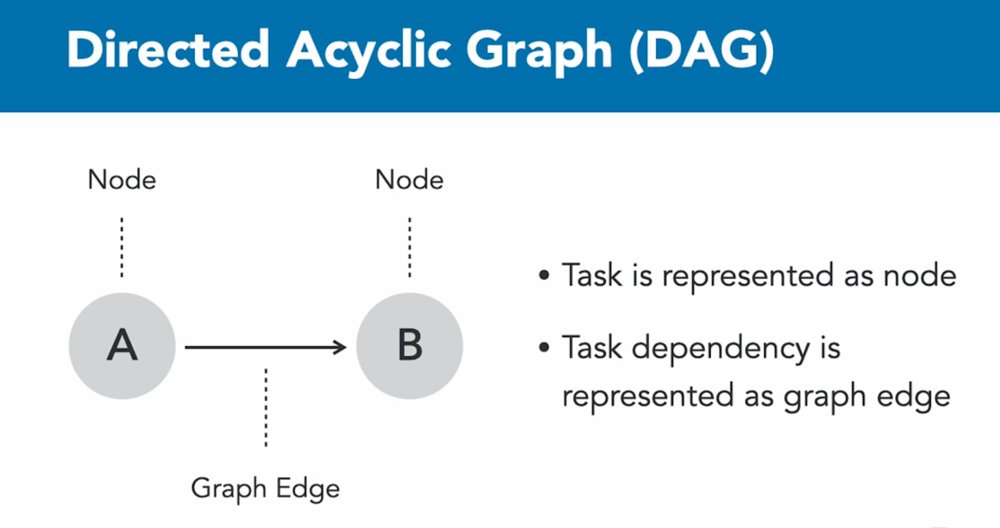

# GRADLE FUNDAMENTALS #  

## 4 What is GRADLE ##

- solves the problem of building and deploying an application once it is written
- framework for building a project
- turns java class, xml etc into jar and war files
 
- Both builds the deployment artifacts and manages the dependencies
 
- Artifacts can be : java source code, xml configuration files, audio or graphic files etc...
- Predecessors to GRADLE include Maven, IVY and ANT. These are configured with XML which is not the most user friendly

- In 2007 Gradle was introduced, it is written in a Java variant called Groovy, this is much more user friendly because we are writhing configurations as code

### The 6 Key Pieces of Gradle ###
1. Build File or build.gradle : must have a build file, 
   - this is both a human and machine readable instruction file, 
   - uses DSL (Domain Specific Language) at a higher level and Groovy (or Kotlin) at a low level.
   - Default name is built gradle 

2. Constructs a Graph of Tasks
   - tasks are detailed build build steps
   - gradle parses the build.gradle to create a directed acyclic graph (DAG) of tasks, ie task1 -> task 2 -> task 3 ...

3. Gradle Executes the Tasks
   - knows the order to do tasks in based on the DAG
   - Each task produces an output used an an input by the next task
   - it saves the output of each task (this step can help with performance improvement by caching tasks outputs for tasks that have not changed and skip the task on a re-build)

4. Manages Dependencies
   - IE maven, plugins etc...
   - Also manages transitive dependencies, ie: dependencies of dependencies
   - Can also handle dependency versions

5. Gradle uses Repositories
   - public or local

6. Gradle is Self Updating
   - gradle can update both itself and the dependencies it manages

## 5 Installing Gradle ##
- can install with brew or manually
- [gradle.org](https://gradle.org/install/)

         brew install gradle

Basic Terminology
- Project - models a software component
- Build script: contain automation instructions for a project
- Task: defines executable automation instructions 
- to see a helloWorld in gradle navigate too ./hello-world/build.gradle
  - can run with ```gradle [taskName]```

## 6 Gradle's DL ##
- can mix in imperative logic 
- can use GROOVY DSL or Kotlin DSL
- can see kotlin example ./hello-world-kotlin/build.gradle.kts
   - has to be named build.gradle.kts
   - seems that by default a build.gradle will override build.gradle.kts if they are in the same directory, maybe some configuration to change this

## 7 Gradle Wrapper ##
- Gradle API can have breaking changes during major version updates
- maintaining multiple different gradle version on your machine for different projects in inconvenient 

- The Gradle wrapper is a set of files checked into version control with source code
   - The wrapper standardizes a compatible gradle version fot he project
   - It will the automatically download the defined version of Gradle

- You can create the gradle wrapper by running ```gradle wrapper```
   - this will create a gradle folder that houses a gradle-wrapper.jar and a gradle-wrapper.properties 
   - it also creates a gradlew shell script, and gradlew.bat(for windows)
   - This now exposes the gradlew command within the project, to run the tasks now we can use ```.gradlew [task name]```
   - when using gradlew gradle will automatically downloaded the distribution needed to run the task based on what was defined in the jar and properties files
   - When using a wrapper it is no necessary to have gradle installed on your machine, however you do need it to create the wrapper

- **With the wrapper method, other developers do not even need to install gradle on their machines, they can just checkout the code (as long as wrapper is store in VCS) and run gradle commands with ```./gradlew [taskName]```

## 9 Build Files ##
- Build file in a single project built 
   - resides in root directory of project hierarchy
   - contains all build logic
   - can be hard to maintain 

- Build in multi-module build
   - have a build.gradle that contains modules which contain their own build.gradle
   - more maintainable and highly cohesive
   - gradle can model each component as a project with dependencies of each other

- Settings File
   - settings.gradle resides in root directory of project hierarchy
   - can declare participating projects as modules
   - change defaults such as project name 
   - can set plugin management and authentication for private repos

- By default gradle defines the project name as the name of the root directory
   - can run ```gradle projects``` to see all projects in the current folder and sub folders
   - ./gradle-wrapper-hello-world/settings.gradle

- Gradle.properties
  - ./gradle-wrapper-hello-world/gradle.properties
  - resides in the root directory of project (for one offs) or ~/.gradle (for all projects on machine)
  - can be used to pre-configure runtime behavior
  - means to externalize custom key values pairs, can set versions, logging levels etc
  - can access these values in the build script by key 

## 10 Tasks ##
- defines an executable unit of work
- actions contain logic to be executed a runtime
- ad hoc tasks and tasks explicitly declare a type

### AD HOC vs Typed Tasks ###
- AD hoc implements off-off simplistic actions by defining a doFirs or doLast

- Automatically extend the default task with out having to declare it 

ex: 

      task runADHOC {
         doLast {
            println "I am an AD HOC task, I automatically extend the default task"
         }
      }
   
- Typed tasks allow for more complex task logic, this task explicitly declares a type
- does not necessarily need to define actions, may inherit them from the tasks it is extending 
- copy type can copy files and directories from A to B

ex: 

      task copyFiles(type: Copy){
         from "sourceFiles"
         into "target"
      }

another example: 

      task createZip (type: Zip){
         from ".build/docs"
         archiveName = "example.zip"
         destinationDir = file(".build/dist")

         //can make this task depend on the previous one and hence make it do the copyFile task first
         dependsOn copyFiles
      }

- depends on calls copyFiles before its code runs

## DAG & Build Lifecycle Phases ##
- https://docs.gradle.org/current/dsl/org.gradle.api.Task.html#N18B7E
- https://docs.gradle.org/current/dsl/org.gradle.api.Task.html#N18C9B
- 
- directed acyclic graph
- if A depends on B and A also depends on C, the B & C can run in any order, however they will both run before A

- Can use mustRunAfter if we always want C to run before B
- other common caveats are shouldRunAfter and finalized by
   - mustRunAfter - 	Specifies that this task must run after all of the supplied tasks.
   - shouldRunAfter - Specifies that this task should run after all of the supplied tasks.
   - finalizedBy - Adds the given finalizer tasks for this task.

### Direct Acyclic Graph ###
- a task is represented as a node
- task dependency is represented as graph edge
<!--  -->
- task A cannot depend on B while B depends on A

- can run ```gradle [task] --dry-run ``` to see all gradle tasks/dependencies for that task

- can use the [gradle task tree](https://github.com/dorongold/gradle-task-tree) plugin in order to render a task tree

- can run ```gradlew tasks --all``` to see all gradle tasks available for the project

- the DAG is built before any tasks is executed
   - when a tasks is called to be executed gradle will:
     
     1.  Evaluate the instructions of the build scripts
     2. create and configure tasks 
     3. execute them in the correct order

LifeCycle Phases: 

1. Initialization phase
   - evaluates the settings.gradle file, gathering information about the projects that should exist for the build
2. Configuration phase
   - Parses and evaluates the configuration logic, here tasks actions are not executed, only configured
   - configuration code configures the project and its tasks
3. Execution phase
   - executes tasks in the correct order based on the DAG
   - any logic that is executed here should be defined as part of the doFirst or doLast 

## 12 Plugins and Domain Objects ##